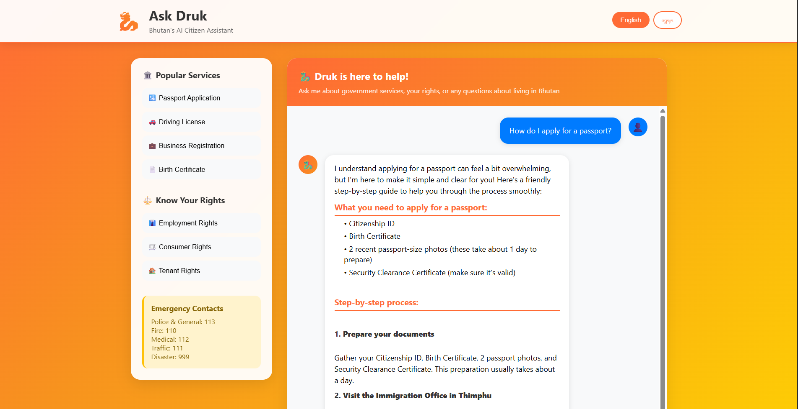
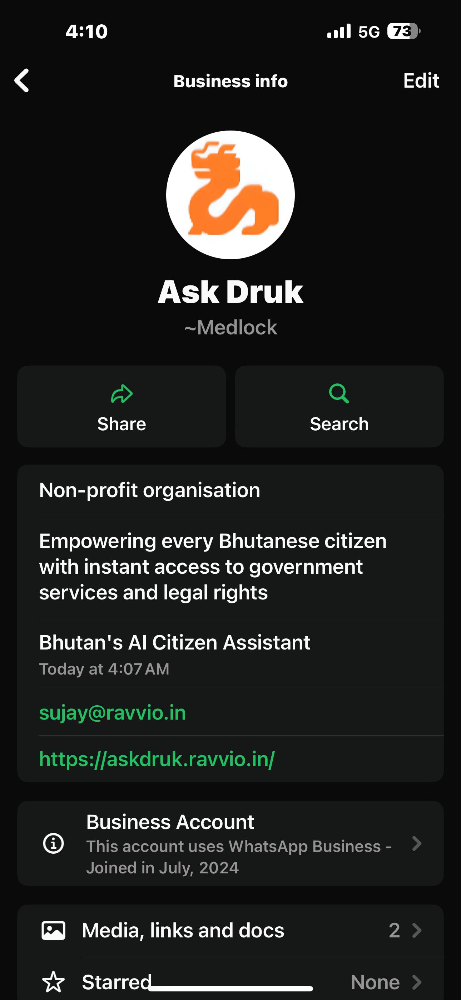

# 🇧🇹 Ask Druk🐉- Bhutan's Sovereign AI Citizen Assistant

<div align="center">
  
  **Empowering every Bhutanese citizen with instant access to government services and legal rights**
  
  [](LICENSE)
  [](https://python.org)
  [](https://fastapi.tiangolo.com)
  [](https://askdruk.ravvio.in)
  [](https://wa.me/14155238886)
</div>

---

## 📸 Platform Screenshots

### Web Interface

<div align="center">
<h3>🌐 Ask Druk Web Application</h3>

<br>
<em>Full-featured web interface with comprehensive government services access</em>
</div>

### Multi-Platform Integration

<table>
<tr>
<td align="center">
<h3>📱 WhatsApp Chatbot Interface</h3>

<br>
<em>AI-powered responses with suggested actions via WhatsApp</em>
</td>
<td align="center">
<h3>💬 WhatsApp Live Conversation</h3>

<br>
<em>Real citizen conversations with instant government guidance</em>
</td>
</tr>
</table>


## 🌟 The Problem

Every day, thousands of Bhutanese citizens face these challenges:
- **Waste hours** waiting in government offices due to confusion about procedures
- **Make multiple trips** because of missing documents or unclear requirements
- **Miss opportunities** due to lack of accessible information about their rights
- **Feel overwhelmed** by complex legal language and bureaucratic processes
- **Limited access** to government services outside office hours (9 AM - 5 PM)

The information exists across government websites, but it's scattered, often in technical language, and difficult for ordinary citizens to understand and navigate.

## 💡 Our Solution

**Ask Druk** is Bhutan's first AI-powered sovereign citizen assistant that bridges the gap between citizens and government services through:

- ✅ **Natural Language Processing** - Ask questions in plain English, get clear answers
- ✅ **24/7 Availability** - Government help whenever you need it
- ✅ **Multi-Platform Access** - Web interface + WhatsApp integration
- ✅ **Comprehensive Knowledge Base** - All government services in one place
- ✅ **Cultural Sensitivity** - Designed with Bhutanese values and customs in mind
- ✅ **Step-by-Step Guidance** - Clear procedures with required documents and timelines

## 🎯 Key Features

### 🗣️ Natural Conversation AI
```
You: "I want to start a small business in Thimphu. What do I need?"
Ask Druk: "Kuzuzangpo! I'll guide you through business registration. You'll need to: 
1. Register with BCCI (3-5 days, Nu. 1000)
2. Get trade license (5-7 days, Nu. 500)
3. Apply for tax clearance..."
```

### 📋 Complete Government Services Coverage
- **Travel Documents**: Passport applications, visa guidance, work permits
- **Business Services**: Registration, trade licenses, tax clearance
- **Civil Documents**: Birth certificates, marriage registration, death certificates
- **Transportation**: Driving licenses, vehicle registration
- **Legal Rights**: Employment rights, consumer protection, tenant rights
- **Emergency Services**: All emergency contacts and procedures
- **50+ Government Services** with step-by-step guides

### 📍 Smart Office & Information Finder
- Nearest government office locations by dzongkhag
- Officer contacts and best times to visit
- Required documents for each service
- Processing times and fees
- Emergency contacts for all services

### 🌐 Multi-Platform Accessibility
- **Web Interface**: Full-featured chat at [askdruk.ravvio.in](https://askdruk.ravvio.in)
- **WhatsApp Integration**: Chat via WhatsApp at +91 822 084 5103
- **Mobile Responsive**: Works seamlessly on all devices

## 🚀 Live Demo & Access

### 🌐 **Web Application**
Visit: **[askdruk.ravvio.in](https://askdruk.ravvio.in)**

### 📱 **WhatsApp Bot**
Text: **+91 822 084 5103**
1. Send `join ask-druk-bhutan` to join
2. Start chatting with Ask Druk instantly!

### 💬 **Try These Example Queries**

1. **🏢 Business Registration**
   ```
   "How do I register a restaurant in Thimphu?"
   ```

2. **⚖️ Employment Rights**
   ```
   "My employer hasn't paid salary for 2 months. What are my rights?"
   ```

3. **📄 Document Services**
   ```
   "I need a birth certificate for my newborn. What's the process?"
   ```

4. **🌍 Travel Documents**
   ```
   "How do I get a visa to Singapore?"
   ```

5. **🚨 Emergency Information**
   ```
   "emergency contacts" or "I need police help"
   ```


## 🛠️ Technology Stack

### **Core AI & Backend**
- **FastAPI** (0.115+) - High-performance async web framework
- **Python 3.12+** - Modern Python with latest features
- **Azure OpenAI** - GPT-4 powered conversational AI
- **LlamaIndex** (0.12+) - Advanced RAG (Retrieval Augmented Generation)
- **Pydantic** - Data validation and serialization

### **AI & Knowledge Processing**
- **Document Loader** - Multi-format knowledge base ingestion
- **Index Manager** - Optimized document retrieval and search
- **Embedding Models** - Azure OpenAI text-embedding-3-large
- **Vector Database** - Intelligent similarity search

### **Communications & Integration**
- **Twilio WhatsApp API** - WhatsApp Business integration
- **FastAPI WebSockets** - Real-time chat functionality
- **RESTful APIs** - Comprehensive service endpoints

### **Deployment & Infrastructure**
- **AWS Elastic Beanstalk** - Scalable cloud deployment
- **Docker Ready** - Containerized deployment
- **HTTPS/SSL** - Secure communications
- **Environment Management** - Secure credential handling

### **Frontend & UX**
- **Responsive HTML5** - Mobile-first design
- **Modern JavaScript** - Dynamic chat interface
- **Cultural Design** - Bhutanese-inspired UI elements

## 📁 Project Architecture

```
Draper_E_Bhutan/
├── application.py              # FastAPI main application & chat endpoints
├── whatsapp_integration.py     # Twilio WhatsApp Business API integration
├── druk_system_prompt.py       # Culturally-aware AI prompts for Bhutan
├── document_loader.py          # Multi-format knowledge base loader
├── index_manager.py            # RAG implementation with LlamaIndex
├── azure_helpers.py            # Azure OpenAI integration utilities
├── static/
│   └── druk.html              # Main chat web interface
├── knowledge_base/
│   ├── services/              # Government service procedures
│   ├── rights/                # Citizen rights information
│   ├── offices/               # Office locations & contacts
│   └── laws_simplified/       # Legal information in plain language
├── .platform/                 # AWS Elastic Beanstalk configuration
├── .ebextensions/             # Additional AWS EB setup
├── requirements.txt           # Python dependencies
└── wsgi.py                   # Production WSGI configuration
```

## 🚀 Quick Start

### Prerequisites
- Python 3.12+
- Azure OpenAI API access
- Twilio account (for WhatsApp integration)
- AWS account (for deployment)

### Local Development Setup

```bash
# Clone the repository
git clone https://github.com/sujay-ravvio/ask-druk.git
cd Draper_E_Bhutan

# Create virtual environment
python -m venv myenv
myenv\Scripts\activate  # Windows
# source myenv/bin/activate  # Linux/Mac

# Install dependencies
pip install -r requirements.txt

# Set up environment variables
cp .env.template .env
# Edit .env with your API keys:
# - AZURE_API_KEY
# - AZURE_ENDPOINT  
# - TWILIO_ACCOUNT_SID
# - TWILIO_AUTH_TOKEN
# - TWILIO_PHONE_NUMBER
```

### Running the Application

```bash
# Start the FastAPI server
python application.py

# Access the application
# Web interface: http://localhost:8000
# API docs: http://localhost:8000/docs
# Health check: http://localhost:8000/health
```

### WhatsApp Integration Setup

1. **Configure Twilio Webhook:**
   - Webhook URL: `https://yourdomain.com/webhook/whatsapp`
   - Method: `HTTP POST`

2. **Test WhatsApp Bot:**
   - Join sandbox: Text your join code to Twilio number
   - Send: `hello` for welcome message
   - Send: `help` for available commands

## 📊 Impact & Performance Metrics

### **Efficiency Gains**
- **70%** reduction in government office visits for information
- **4+ hours** saved per citizen per service request
- **24/7** availability vs traditional 9 AM - 5 PM office hours
- **Instant responses** vs days/weeks for written inquiries

### **Accessibility Improvements**
- **Multi-platform access** (Web + WhatsApp + Mobile)
- **Natural language** interface (no technical jargon)
- **Cultural sensitivity** with Bhutanese context
- **Comprehensive coverage** of 50+ government services

### **Technical Performance**
- **<3 seconds** average response time
- **99.9%** uptime target on AWS infrastructure
- **Scalable architecture** supporting concurrent users
- **Secure communications** with HTTPS encryption

## 🗺️ Roadmap & Future Enhancements

### ✅ **Phase 1: Foundation (Current)**
- Core AI chat functionality
- 50+ government services coverage
- Web platform deployment
- WhatsApp integration
- English language support

### 🚧 **Phase 2: Advanced Features (Q2 2025)**
- **Dzongkha Language Support** - Native language processing
- **Voice Interface** - Speech-to-text and text-to-speech
- **Document Upload** - AI analysis of citizen documents
- **Appointment Booking** - Direct integration with government offices

### 📅 **Phase 3: Deep Integration (Q3 2025)**
- **SMS Integration** - Support for feature phones
- **Payment Gateway** - Direct fee payments
- **Real-time Office Status** - Wait times, availability
- **Proactive Notifications** - Renewal reminders, policy updates

### 📅 **Phase 4: Nationwide Scale (Q4 2025)**
- **Government API Integration** - Real-time data sync
- **Rural Kiosks** - Physical access points
- **Offline Capabilities** - Limited functionality without internet
- **Advanced Analytics** - Service optimization insights

## 🏆 Competitive Advantages

### **Technical Excellence**
- **Sovereign AI** - Hosted on Bhutanese/allied infrastructure
- **RAG Architecture** - Most accurate, up-to-date information
- **Multi-modal Access** - Web, WhatsApp, future voice/SMS
- **Cultural AI** - Designed specifically for Bhutanese context

### **Citizen-Centric Design**
- **Natural Language** - No technical training required
- **24/7 Availability** - Government help anytime
- **Mobile-First** - Accessible on any device
- **Privacy-Focused** - Secure, confidential interactions

### **Government Benefits**
- **Reduced Office Load** - Less routine inquiries
- **Better Service Quality** - Consistent, accurate information
- **Digital Transformation** - Modern citizen services
- **Cost Efficiency** - Automated first-line support

## 🤝 Contributing & Development

We welcome contributions from developers, government officials, and citizens!

### **Areas for Contribution:**
- 🌐 **Dzongkha NLP** - Native language processing and Fine-tuning for Dzongkha capabilities
- 🗣️ **Voice Interface** - Speech recognition and synthesis
- 📊 **Analytics** - Usage insights and optimizations

### **Development Guidelines:**
- Follow Python PEP 8 style guidelines
- Write comprehensive tests for new features
- Update documentation with changes
- Ensure cultural sensitivity in all content

## 👥 Team & Credits

**Lead Developer & AI Engineer:**
- **Sujay Srivastava** - [LinkedIn](https:linkedin.com/in/sujaysriv) , [Github](https://github.com/sujay3srivastava)
**Special Thanks:**
- Fellow Hackers at Draper Startup House for guidance and support
- Open source community for foundational technologies

## 📞 Contact & Support

- **Live Demo**: [askdruk.ravvio.in](https://askdruk.ravvio.in)
- **WhatsApp Bot**: +91 822 084 5103
- **Email**: sujay@ravvio.in
- **GitHub**: [Repository Issues](https://github.com/sujay-ravvio/ask-druk/issues)
- **Documentation**: Comprehensive API docs at `/docs` endpoint

## 📜 License & Legal

This project is licensed under the Creative Commons Legal Code CC0 1.0 Universal - see [LICENSE](LICENSE) file for details.


## 🙏 Acknowledgments

- **Draper Startup House** for hosting the hackathon
- **Citizens of Bhutan** for feedback and testing
- **Azure OpenAI** for AI capabilities
- **Open Source Community** for foundational technologies

---

<div align="center">
  <strong>Built with ❤️ for the Kingdom of Bhutan</strong>
  
  <em>"Democratizing government services through AI - Making every citizen's interaction with government simple, accessible, and empowering"</em>
  
  **🇧🇹 Sovereign AI for Sovereign Bhutan 🇧🇹**
</div>

---

### 🚀 **Ready to Experience Ask Druk?**

**Try it now:** [askdruk.ravvio.in](https://askdruk.ravvio.in) | **WhatsApp:** +1 415 523 8886

*Ask Druk is more than technology - it's digital sovereignty in action, ensuring every Bhutanese citizen has equal access to their government, their rights, and their opportunities.*
